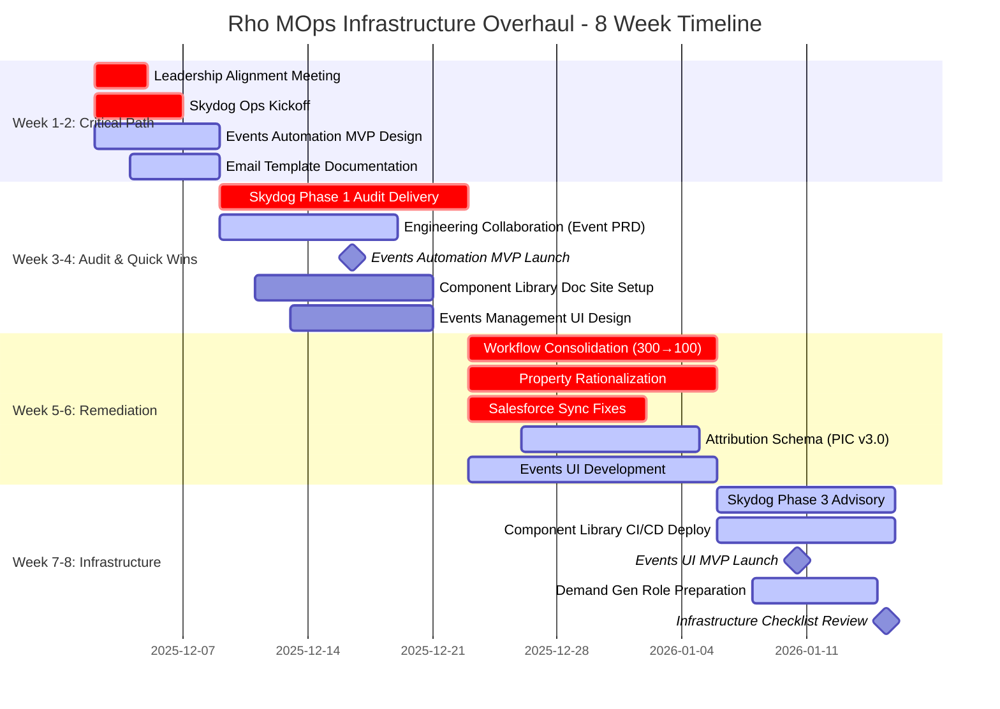

# PROJECT ROADMAP: 8-WEEK INFRASTRUCTURE OVERHAUL

**Timeline**: December 2025 - January 2026 (Condensed from 12 weeks to 8 weeks)
**Owner**: Christopher Cooper (Marketing Operations)
**Status**: 🟡 In Progress - Week 1 Foundation Phase

---

## 📊 VISUAL TIMELINE (MERMAID GANTT CHART)



---

## 📅 DETAILED WEEK-BY-WEEK BREAKDOWN

### **WEEK 1: Critical Path Initiation** (Dec 2-6, 2025)

#### 🔴 P0 - BLOCKING ITEMS (Must Complete)

| Task ID | Task | Owner | Status | Deliverable | Dependencies | Notes |
|---------|------|-------|--------|-------------|--------------|-------|
| W1-P0-1 | **Request Leadership Alignment Meeting** | Christopher Cooper | 🔴 Not Started | Meeting scheduled for Week 1 | None | CRITICAL: Blocks all strategic decisions |
| W1-P0-2 | **Prepare Meeting Materials** | Christopher Cooper | 🔴 Not Started | Slide deck: Role definition, RACI chart, budget breakdown | W1-P0-1 | Use docs from this project |
| W1-P0-3 | **Conduct Leadership Meeting** | Tommy, Jeremy, Anthony | 🔴 Not Started | Decisions: Demand Gen vs Lifecycle, Ownership model, Q1 timeline | W1-P0-1, W1-P0-2 | 60-min meeting |
| W1-P0-4 | **Document Leadership Decisions** | Christopher Cooper | 🔴 Not Started | CHANGELOG entry, updated README status | W1-P0-3 | Share with all stakeholders |
| W1-P0-5 | **Skydog Ops Kickoff Meeting** | Christopher Cooper + Skydog | 🔴 Not Started | Agreed 3-phase SOW, access credentials | W1-P0-3 | Share all project docs |

#### 🟡 P1 - HIGH PRIORITY

| Task ID | Task | Owner | Status | Deliverable | Dependencies | Notes |
|---------|------|-------|-------------|--------------|-------|
| W1-P1-1 | **Create Airtable Event Registry Base** | Christopher Cooper | 🔴 Not Started | Airtable base: Events + Registrations tables | None | Schema in 03-events-automation.md |
| W1-P1-2 | **Build Luma → Airtable Zapier Flow** | Christopher Cooper | 🔴 Not Started | Zap: Luma webhook → Airtable | W1-P1-1 | Test with upcoming event |
| W1-P1-3 | **Document Email Template Process** | Christopher Cooper | 🔴 Not Started | Loom video + written guide | None | Current: React JSX → HubSpot manual |
| W1-P1-4 | **Push Project Docs to GitHub** | Christopher Cooper | 🔴 Not Started | All .md files in christophercooper-wq/mops-projects | None | This task! |
| W1-P1-5 | **Set Up Google Drive Sync** | Christopher Cooper | 🔴 Not Started | Two-way sync configured | W1-P1-4 | Use GitHub Actions |

#### 🟢 P2 - NICE TO HAVE

| Task ID | Task | Owner | Status | Deliverable | Dependencies | Notes |
|---------|------|-------|-------------|--------------|-------|
| W1-P2-1 | **Create GitHub Projects Board** | Christopher Cooper | 🔴 Not Started | Kanban board with all tasks | W1-P1-4 | Link from README |
| W1-P2-2 | **Design Component Library Doc Site** | Christopher Cooper | 🔴 Not Started | Tech stack decision + wireframes | None | Options: Docusaurus, VitePress, Next.js |

**Week 1 Success Criteria**:
- ✅ Leadership meeting scheduled and held
- ✅ Skydog kickoff complete with access granted
- ✅ Airtable event registry MVP live
- ✅ All docs in GitHub with Google Drive sync

---

### **WEEK 2: Quick Wins & Foundation** (Dec 9-13, 2025)

#### 🔴 P0 - BLOCKING ITEMS

| Task ID | Task | Owner | Status | Deliverable | Dependencies | Notes |
|---------|------|-------|-------------|--------------|-------|
| W2-P0-1 | **Skydog Phase 1 Kickoff** | Skydog Ops | 🔴 Not Started | Audit plan, timeline, access confirmed | W1-P0-5 | 3-week delivery timeline |
| W2-P0-2 | **Share All Context with Skydog** | Christopher Cooper | 🔴 Not Started | GitHub repo access, strategic audit docs, HubSpot/SFDC overview | W2-P0-1 | Include this entire project |

#### 🟡 P1 - HIGH PRIORITY

| Task ID | Task | Owner | Status | Deliverable | Dependencies | Notes |
|---------|------|-------|-------------|--------------|-------|
| W2-P1-1 | **Test Events Automation with Live Event** | Christopher Cooper | 🔴 Not Started | 1 event fully automated (Luma → Airtable → HubSpot) | W1-P1-1, W1-P1-2 | Document issues/learnings |
| W2-P1-2 | **Create Manual Upload Form** | Christopher Cooper | 🔴 Not Started | Airtable form for partner/sales events | W1-P1-1 | Non-Luma events |
| W2-P1-3 | **Draft Engineering Event Emission PRD** | Christopher Cooper | 🔴 Not Started | 1-pager: Event schema, emission requirements, API spec | None | Use "45-Min Gap" doc as base |
| W2-P1-4 | **Schedule Eng Collaboration Meeting** | Christopher Cooper | 🔴 Not Started | Meeting scheduled with Signup Services team | W2-P1-3 | Share PRD beforehand |
| W2-P1-5 | **Email Template Velocity Training** | Christopher Cooper | 🔴 Not Started | Loom video shared with marketing team | W1-P1-3 | Target: <1 day deployment |

#### 🟢 P2 - NICE TO HAVE

| Task ID | Task | Owner | Status | Deliverable | Dependencies | Notes |
|---------|------|-------|-------------|--------------|-------|
| W2-P2-1 | **Begin Component Library CI/CD Planning** | Christopher Cooper | 🔴 Not Started | Requirements doc, tech stack evaluation | W1-P2-2 | Detail in Week 3 |

**Week 2 Success Criteria**:
- ✅ Skydog audit in progress (access granted, plan agreed)
- ✅ 1 event successfully automated end-to-end
- ✅ Engineering has event emission PRD
- ✅ Email deployment process documented + trained

---

### **WEEK 3: Audit Delivery & Architecture** (Dec 16-20, 2025)

#### 🔴 P0 - BLOCKING ITEMS

| Task ID | Task | Owner | Status | Deliverable | Dependencies | Notes |
|---------|------|-------|-------------|--------------|-------|
| W3-P0-1 | **Skydog Phase 1 Interim Update** | Skydog Ops | 🔴 Not Started | Preliminary findings, critical issues flagged | W2-P0-1 | Mid-audit checkpoint |
| W3-P0-2 | **Review Interim Findings** | Christopher Cooper + Anthony | 🔴 Not Started | Prioritized issue list, Phase 2 scope adjustments | W3-P0-1 | Ensure alignment |

#### 🟡 P1 - HIGH PRIORITY

| Task ID | Task | Owner | Status | Deliverable | Dependencies | Notes |
|---------|------|-------|-------------|--------------|-------|
| W3-P1-1 | **Conduct Engineering Collaboration Meeting** | Christopher Cooper + Eng | 🔴 Not Started | Event emission roadmap, Q1 2026 commitment (or Q2) | W2-P1-4 | Document outcomes |
| W3-P1-2 | **Expand Events Automation** | Christopher Cooper | 🔴 Not Started | 3+ events automated, manual upload form tested | W2-P1-1, W2-P1-2 | Prove scalability |
| W3-P1-3 | **Design Events Management UI** | Christopher Cooper | 🔴 Not Started | Wireframes, tech stack decision (Retool vs custom) | W2-P1-2 | Detail in 11-events-management-ui.md |
| W3-P1-4 | **Component Library Doc Site Tech Stack** | Christopher Cooper | 🔴 Not Started | Decision: Docusaurus, VitePress, or Next.js | W2-P2-1 | Evaluate CI/CD options |

#### 🟢 P2 - NICE TO HAVE

| Task ID | Task | Owner | Status | Deliverable | Dependencies | Notes |
|---------|------|-------|-------------|--------------|-------|
| W3-P2-1 | **Draft Storyblok Integration Plan** | Christopher Cooper | 🔴 Not Started | Q1 2026 migration plan outline | None | Detail in 12-storyblok-integration.md |

**Week 3 Success Criteria**:
- ✅ Skydog audit 50% complete with interim report
- ✅ Engineering committed to event emission timeline
- ✅ Events automation proven with 3+ live events
- ✅ Component library tech stack decided

---

### **WEEK 4: Audit Completion & Transition** (Dec 23-27, 2025)

#### 🔴 P0 - BLOCKING ITEMS

| Task ID | Task | Owner | Status | Deliverable | Dependencies | Notes |
|---------|------|-------|-------------|--------------|-------|
| W4-P0-1 | **Skydog Phase 1 Final Delivery** | Skydog Ops | 🔴 Not Started | Complete audit report: HubSpot health, data architecture, recommendations | W3-P0-1 | 3 deliverables per SOW |
| W4-P0-2 | **Review Audit with Anthony** | Christopher Cooper + Anthony | 🔴 Not Started | Approved priority list for Phase 2 | W4-P0-1 | Decide: workflow consolidation order |
| W4-P0-3 | **Approve Skydog Phase 2 Execution Plan** | Anthony Hwang | 🔴 Not Started | Signed-off remediation plan, timeline, success criteria | W4-P0-2 | Weeks 5-6 scope |

#### 🟡 P1 - HIGH PRIORITY

| Task ID | Task | Owner | Status | Deliverable | Dependencies | Notes |
|---------|------|-------|-------------|--------------|-------|
| W4-P1-1 | **Document Engineering Event Emission Roadmap** | Christopher Cooper | 🔴 Not Started | CHANGELOG entry, updated 08-technical-architecture.md | W3-P1-1 | Even if Q2 2026 commitment |
| W4-P1-2 | **Events Automation Handoff Documentation** | Christopher Cooper | 🔴 Not Started | SOP for events team, troubleshooting guide | W3-P1-2 | Enable team self-service |
| W4-P1-3 | **Component Library Doc Site Development Start** | Christopher Cooper | 🔴 Not Started | Repo setup, initial pages, preview system | W3-P1-4 | Week 5-6 development |

**Week 4 Success Criteria**:
- ✅ Skydog Phase 1 complete: Audit delivered, recommendations prioritized
- ✅ Phase 2 execution plan approved (Weeks 5-6 roadmap locked)
- ✅ Events automation fully documented + handed off
- ✅ Engineering roadmap documented (even if Q2 implementation)

---

### **WEEK 5: Remediation Execution** (Dec 30, 2025 - Jan 3, 2026)

#### 🔴 P0 - BLOCKING ITEMS

| Task ID | Task | Owner | Status | Deliverable | Dependencies | Notes |
|---------|------|-------|-------------|--------------|-------|
| W5-P0-1 | **Skydog: Begin Workflow Consolidation** | Skydog Ops | 🔴 Not Started | First 50 workflows audited + consolidation plan | W4-P0-3 | Target: 300+ → 150 by end of Week 5 |
| W5-P0-2 | **Skydog: Property Audit & Archive Plan** | Skydog Ops | 🔴 Not Started | Tier 5 (legacy) properties identified for archival | W4-P0-3 | Archive ~30% of properties |
| W5-P0-3 | **Skydog: SFDC Sync Error Root Cause** | Skydog Ops | 🔴 Not Started | Error analysis, fix plan for top 10 errors | W4-P0-3 | Custom code, picklist errors |

#### 🟡 P1 - HIGH PRIORITY

| Task ID | Task | Owner | Status | Deliverable | Dependencies | Notes |
|---------|------|-------|-------------|--------------|-------|
| W5-P1-1 | **QA Skydog Workflow Consolidation** | Christopher Cooper | 🔴 Not Started | Test new consolidated workflows before cutover | W5-P0-1 | Ensure no lead routing breaks |
| W5-P1-2 | **Design Attribution Schema (PIC v3.0)** | Christopher Cooper + Skydog | 🔴 Not Started | Canonical schema: First Touch, Last Touch, field definitions | W5-P0-2 | Document in 05-hubspot-audit.md |
| W5-P1-3 | **Events Management UI Development** | Christopher Cooper | 🔴 Not Started | Build UI (Retool or custom), CSV upload, field mapping | W3-P1-3 | Week 6 testing |
| W5-P1-4 | **Component Library Doc Site Build** | Christopher Cooper | 🔴 Not Started | Static site generation, component pages, code blocks | W4-P1-3 | Week 6 CI/CD integration |

**Week 5 Success Criteria**:
- ✅ 150 workflows consolidated (50% progress toward 100 target)
- ✅ Tier 5 properties archived
- ✅ SFDC sync error fix plan documented
- ✅ Attribution schema (PIC v3.0) designed + approved

---

### **WEEK 6: Remediation Completion** (Jan 6-10, 2026)

#### 🔴 P0 - BLOCKING ITEMS

| Task ID | Task | Owner | Status | Deliverable | Dependencies | Notes |
|---------|------|-------|-------------|--------------|-------|
| W6-P0-1 | **Skydog: Complete Workflow Consolidation** | Skydog Ops | 🔴 Not Started | 300+ → <100 workflows, old workflows archived | W5-P0-1 | Final cutover |
| W6-P0-2 | **Skydog: Implement Property Rationalization** | Skydog Ops | 🔴 Not Started | Tier 5 archived, Tier 2 standardized, forms updated | W5-P0-2 | Update all forms |
| W6-P0-3 | **Skydog: Fix SFDC Sync Errors** | Skydog Ops | 🔴 Not Started | Validation rule bypasses, field mappings fixed | W5-P0-3 | Target: <10% error rate |
| W6-P0-4 | **Skydog Phase 2 Delivery** | Skydog Ops | 🔴 Not Started | Remediation report, before/after metrics, documentation | W6-P0-1, W6-P0-2, W6-P0-3 | 2-week phase complete |

#### 🟡 P1 - HIGH PRIORITY

| Task ID | Task | Owner | Status | Deliverable | Dependencies | Notes |
|---------|------|-------|-------------|--------------|-------|
| W6-P1-1 | **Implement Attribution Schema (PIC v3.0)** | Christopher Cooper + Skydog | 🔴 Not Started | New PIC v3.0 workflows live, 47 legacy workflows updated | W5-P1-2 | Migration + testing |
| W6-P1-2 | **Test Events Management UI** | Christopher Cooper | 🔴 Not Started | Upload test CSVs (Luma, partner, manual), verify field mapping | W5-P1-3 | Fix bugs before Week 7 launch |
| W6-P1-3 | **Component Library CI/CD Pipeline** | Christopher Cooper | 🔴 Not Started | GitHub Actions: PR → build → deploy to HubSpot API | W5-P1-4 | Test with 1 component |

**Week 6 Success Criteria**:
- ✅ Workflows <100 (from 300+)
- ✅ Property count reduced 30%+
- ✅ SFDC sync error rate <10% (interim goal, <5% by Week 8)
- ✅ Attribution schema (PIC v3.0) live
- ✅ Events UI tested and ready for launch

---

### **WEEK 7: Strategic Infrastructure & Launch** (Jan 13-17, 2026)

#### 🔴 P0 - BLOCKING ITEMS

| Task ID | Task | Owner | Status | Deliverable | Dependencies | Notes |
|---------|------|-------|-------------|--------------|-------|
| W7-P0-1 | **Skydog Phase 3 Kickoff (Advisory)** | Skydog Ops | 🔴 Not Started | Event bus architecture design, recommendations | W6-P0-4 | Advisory only (no implementation) |
| W7-P0-2 | **Review SFDC Sync Error Rate** | Christopher Cooper + Skydog | 🔴 Not Started | Final fixes if not <5% | W6-P0-3 | Target: <5% by Week 8 |

#### 🟡 P1 - HIGH PRIORITY

| Task ID | Task | Owner | Status | Deliverable | Dependencies | Notes |
|---------|------|-------|-------------|--------------|-------|
| W7-P1-1 | **Launch Events Management UI MVP** | Christopher Cooper | 🔴 Not Started | UI live, events team trained, 100% uploads via UI | W6-P1-2 | 🎉 Major milestone |
| W7-P1-2 | **Deploy Component Library Doc Site** | Christopher Cooper | 🔴 Not Started | Live doc site, CI/CD pipeline operational | W6-P1-3 | 🎉 Major milestone |
| W7-P1-3 | **Test Component Auto-Deploy** | Christopher Cooper | 🔴 Not Started | Update 1 component, verify auto-deploy to HubSpot | W7-P1-2 | End-to-end test |
| W7-P1-4 | **Engineering Event Emission Follow-Up** | Christopher Cooper | 🔴 Not Started | Confirm Q1/Q2 2026 implementation timeline | W4-P1-1 | Update CHANGELOG |

#### 🟢 P2 - NICE TO HAVE

| Task ID | Task | Owner | Status | Deliverable | Dependencies | Notes |
|---------|------|-------|-------------|--------------|-------|
| W7-P2-1 | **Draft Marketing Automation Evaluation** | Christopher Cooper + Skydog | 🔴 Not Started | Customer.io vs HubSpot Marketing Hub comparison | W7-P0-1 | Q1 2026 decision |

**Week 7 Success Criteria**:
- ✅ Events Management UI live (100% uploads automated)
- ✅ Component Library CI/CD live (<4hr deployment time)
- ✅ Skydog Phase 3 advisory in progress
- ✅ Engineering timeline confirmed for event emission

---

### **WEEK 8: Finalization & Hiring Prep** (Jan 20-24, 2026)

#### 🔴 P0 - BLOCKING ITEMS

| Task ID | Task | Owner | Status | Deliverable | Dependencies | Notes |
|---------|------|-------|-------------|--------------|-------|
| W8-P0-1 | **Skydog Phase 3 Final Delivery** | Skydog Ops | 🔴 Not Started | Event bus recommendations, marketing automation evaluation, next steps | W7-P0-1 | Advisory complete |
| W8-P0-2 | **Verify SFDC Sync <5% Error Rate** | Christopher Cooper | 🔴 Not Started | Final error rate measurement, remaining issues documented | W7-P0-2 | Must hit <5% |
| W8-P0-3 | **Infrastructure Readiness Checklist** | Christopher Cooper | 🔴 Not Started | Checklist complete: workflows, sync, events, email, attribution, lifecycle stages | All prior tasks | Go/no-go for Demand Gen hire |

#### 🟡 P1 - HIGH PRIORITY

| Task ID | Task | Owner | Status | Deliverable | Dependencies | Notes |
|---------|------|-------|-------------|--------------|-------|
| W8-P1-1 | **Lifecycle Stage Definitions Workshop** | Leadership + Christopher Cooper | 🔴 Not Started | Agreed lifecycle stages: Lead → MQL → SQL → SAL → Opp | W7-P0-1 | Unblock the BLOCKER |
| W8-P1-2 | **Implement Lifecycle Stage Workflows** | Christopher Cooper | 🔴 Not Started | HubSpot workflows for stage progression | W8-P1-1 | Auto + manual transitions |
| W8-P1-3 | **Demand Gen Role JD Update** | Christopher Cooper + Jeremy | 🔴 Not Started | Revised JD (Demand Gen not Lifecycle), updated competencies | W8-P0-3 | Ready to repost |
| W8-P1-4 | **Onboarding Plan for Demand Gen Hire** | Christopher Cooper | 🔴 Not Started | 90-day plan, MOps support SLA, infrastructure overview | W8-P0-3 | Use this project docs |

#### 🟢 P2 - NICE TO HAVE

| Task ID | Task | Owner | Status | Deliverable | Dependencies | Notes |
|---------|------|-------|-------------|--------------|-------|
| W8-P2-1 | **Project Retrospective** | Christopher Cooper + Anthony + Skydog | 🔴 Not Started | Lessons learned, what worked, what didn't | W8-P0-1 | Improve future projects |
| W8-P2-2 | **Update All Documentation** | Christopher Cooper | 🔴 Not Started | Final README, CHANGELOG, architecture docs | All prior tasks | Archive project |

**Week 8 Success Criteria**:
- ✅ Infrastructure readiness: All 6 checklist items ✅
- ✅ SFDC sync error rate <5%
- ✅ Lifecycle stages defined + implemented
- ✅ Demand Gen role ready to repost
- ✅ Skydog engagement complete (all 3 phases delivered)
- ✅ Events UI handling 100% of uploads
- ✅ Component library deployment <4 hours

---

## 📋 GITHUB PROJECTS BOARD STRUCTURE

### **Board Columns (Kanban)**

1. **📋 Backlog** - All planned tasks not yet started
2. **🔴 Blocked** - Tasks waiting on external dependencies
3. **🏃 In Progress** - Actively being worked on (limit: 5 tasks max)
4. **👀 Review** - Awaiting approval/QA
5. **✅ Done** - Completed

### **GitHub Issues Template**

Each task above becomes a GitHub Issue with:

```markdown
## Task: [Task Name]

**Task ID**: W[X]-P[0-2]-[#]
**Priority**: 🔴 P0 / 🟡 P1 / 🟢 P2
**Owner**: [@username]
**Week**: Week [X]

### Description
[What needs to be done]

### Deliverable
[Specific output/artifact]

### Dependencies
- [ ] Task W[X]-P[X]-[#] (Issue #[Y])
- [ ] External: [e.g., Leadership decision, Eng API]

### Acceptance Criteria
- [ ] Criterion 1
- [ ] Criterion 2

### Links
- [Related Doc](path/to/doc.md)
- [CHANGELOG Entry](CHANGELOG.md#date)

### Notes
[Additional context]
```

### **GitHub Projects Automation**

**Automated Workflows**:
1. New issue created → Auto-assign to "Backlog"
2. Issue assigned to person → Move to "In Progress"
3. PR linked to issue → Move to "Review"
4. Issue closed → Move to "Done"

**Labels**:
- `priority:p0-critical` (red)
- `priority:p1-high` (yellow)
- `priority:p2-nice-to-have` (green)
- `phase:week-1-2` through `phase:week-7-8`
- `owner:christopher`, `owner:anthony`, `owner:skydog`, `owner:engineering`
- `blocker` (red flag)
- `milestone` (purple star)

---

## 🎯 DEPENDENCY MAP

### **Critical Path (Blocking Dependencies)**

```
Leadership Meeting (W1-P0-3)
    ↓
Skydog Kickoff (W1-P0-5)
    ↓
Phase 1 Audit (W2-P0-1 → W4-P0-1)
    ↓
Phase 2 Approval (W4-P0-3)
    ↓
Workflow Consolidation (W5-P0-1 → W6-P0-1)
    ↓
Phase 2 Delivery (W6-P0-4)
    ↓
Infrastructure Readiness (W8-P0-3)
    ↓
Demand Gen Hire (Post-project)
```

### **Parallel Workstreams (Non-Blocking)**

**Workstream A: Events Automation**
```
Airtable Setup (W1-P1-1) → Luma Zap (W1-P1-2) → Test (W2-P1-1) →
Manual Form (W2-P1-2) → UI Design (W3-P1-3) → UI Build (W5-P1-3) →
UI Test (W6-P1-2) → UI Launch (W7-P1-1)
```

**Workstream B: Component Library CI/CD**
```
Tech Stack Decision (W3-P1-4) → Dev Start (W4-P1-3) →
Build Site (W5-P1-4) → CI/CD Pipeline (W6-P1-3) →
Deploy (W7-P1-2) → Test (W7-P1-3)
```

**Workstream C: Engineering Collaboration**
```
Draft PRD (W2-P1-3) → Schedule Meeting (W2-P1-4) →
Conduct Meeting (W3-P1-1) → Document Roadmap (W4-P1-1) →
Follow-Up (W7-P1-4)
```

### **Vendor Dependencies (Skydog Ops)**

| Deliverable | Week | Depends On | Blocks |
|-------------|------|------------|--------|
| Phase 1 Audit Complete | W4 | W1 Kickoff | W5-W6 Remediation |
| Workflow Consolidation | W5-W6 | W4 Approval | W8 Infrastructure Checklist |
| Property Rationalization | W5-W6 | W4 Approval | W8 Infrastructure Checklist |
| SFDC Sync Fixes | W5-W6 | W4 Approval | W8 <5% Error Rate Goal |
| Phase 3 Advisory | W7-W8 | W6 Phase 2 Complete | Q1 2026 Decisions |

---

## 📊 PROGRESS TRACKING

### **Weekly Status Update Template**

```markdown
## Week [X] Status Update - [Date Range]

### Completed This Week
- ✅ Task W[X]-P[X]-[#]: [Task Name]
- ✅ Task W[X]-P[X]-[#]: [Task Name]

### In Progress
- 🟡 Task W[X]-P[X]-[#]: [Task Name] - [% Complete]

### Blocked
- 🔴 Task W[X]-P[X]-[#]: [Task Name] - [Blocker Description]

### Next Week Priorities
- Task W[X+1]-P[X]-[#]: [Task Name]

### Risks & Issues
- [Risk/Issue Description] - [Mitigation Plan]

### Decisions Needed
- [Decision Required] - [Owner] - [Deadline]
```

### **Overall Project Health Metrics**

| Metric | Target | Current | Status |
|--------|--------|---------|--------|
| **Tasks Complete** | Week-by-week targets | TBD | 🟡 Track weekly |
| **HubSpot Workflows** | <100 (from 300+) | 300+ | 🔴 Week 6 target |
| **SFDC Sync Error Rate** | <5% | ~15% | 🔴 Week 8 target |
| **Property Count** | -30% reduction | Baseline TBD | 🟡 Week 6 target |
| **Events Automated** | 100% (zero manual uploads) | 0% | 🔴 Week 7 target |
| **Email Deploy Time** | <4 hours | 2-4 days | 🔴 Week 7 target |
| **Budget Utilization** | $32K total | $0 (not started) | 🟢 On budget |

---

## 🚀 POST-PROJECT ROADMAP (Q1 2026)

### **January 2026 (Post-Week 8)**

| Task | Owner | Timeline | Dependencies |
|------|-------|----------|--------------|
| **Reopen Demand Gen Role** | Jeremy Liang | Week 9 | W8-P1-3 (Updated JD) |
| **Interview Demand Gen Candidates** | Jeremy + Panel | Weeks 10-12 | Infrastructure checklist ✅ |
| **Storyblok Migration POC** | Christopher Cooper | Weeks 9-12 | Component Library CI/CD ✅ |
| **Engineering: Event Emission Implementation** | Engineering Team | Q1 2026 (TBD) | W4-P1-1 (PRD approved) |

### **Q2 2026 (If Eng Event Emission Delayed)**

| Task | Owner | Timeline | Dependencies |
|------|-------|----------|--------------|
| **Event Emission Implementation** | Engineering Team | Q2 2026 | Engineering backlog prioritization |
| **Real-Time Lead Acceleration** | Christopher Cooper | Q2 2026 | Event emission live |
| **Progress State Cache** | Engineering Team | Q2 2026 | Event emission live |
| **Sales Dashboard (Who's Stuck)** | Engineering Team | Q2 2026 | Progress state cache |

---

## 📝 NOTES & ASSUMPTIONS

### **Key Assumptions**

1. **Leadership Alignment**: Tommy/Jeremy/Anthony can meet in Week 1 and make decisions
2. **Skydog Availability**: Vendor can start Week 1 and deliver on 8-week timeline
3. **Engineering Capacity**: Eng team can review event emission PRD in Week 3, but implementation may slip to Q2 2026
4. **Budget**: $32K is sufficient for 3-phase engagement (approved)
5. **Access**: Christopher Cooper can access HubSpot, Salesforce, Airtable, GitHub without blockers
6. **Holidays**: Week 4 (Dec 23-27) overlaps with holidays but Skydog can still deliver Phase 1

### **Risk Mitigation**

| Risk | Probability | Impact | Mitigation |
|------|-------------|--------|------------|
| Leadership meeting doesn't happen Week 1 | Medium | 🔴 Critical | Escalate to Anthony immediately if not scheduled by Dec 4 |
| Skydog can't start Week 1 | Low | 🔴 Critical | Have backup vendor identified (contingency plan) |
| Eng can't commit to event emission | High | 🟡 High | Accept Q2 2026 timeline, document as advisory-only in Phase 3 |
| SFDC sync can't reach <5% | Medium | 🟡 High | Accept <10% as acceptable, document remaining errors for Q2 |
| Workflow consolidation breaks lead routing | Medium | 🔴 Critical | Parallel testing Week 5, rollback plan, gradual cutover |

### **Success Factors**

1. ✅ Christopher Cooper has dedicated time to manage project (not other urgent priorities)
2. ✅ Anthony provides air cover and removes organizational blockers
3. ✅ Skydog Ops has senior-level consultants (not junior resources)
4. ✅ Leadership makes decisions in Week 1 (doesn't defer/delay)
5. ✅ Engineering engages collaboratively on event emission PRD (even if implementation delayed)

---

## 🎉 FINAL MILESTONE: WEEK 8 DELIVERABLE

### **Infrastructure Readiness Checklist**

**All items must be ✅ to reopen Demand Gen role:**

- [ ] **HubSpot Workflows**: <100 workflows (from 300+)
- [ ] **SFDC Sync**: <5% error rate (from ~15%)
- [ ] **Properties**: 30%+ reduction, Tier 5 archived
- [ ] **Attribution**: PIC v3.0 live, 47 legacy workflows updated
- [ ] **Events**: 100% automated via Events Management UI
- [ ] **Email**: Component library CI/CD live, <4hr deployment
- [ ] **Lifecycle Stages**: Defined, implemented, documented
- [ ] **Engineering Roadmap**: Event emission timeline confirmed (Q1 or Q2 2026)
- [ ] **Role Definition**: Leadership-approved Demand Gen JD
- [ ] **Onboarding Plan**: 90-day plan for Demand Gen hire

**If all ✅**: Reopen role immediately (Week 9)
**If any 🔴**: Delay hiring until blockers resolved

---

**Roadmap Maintained By**: Christopher Cooper
**Last Updated**: 2025-11-12
**Next Review**: Weekly (every Monday)
**Status**: 🟡 Week 1 execution pending (awaiting leadership meeting)
